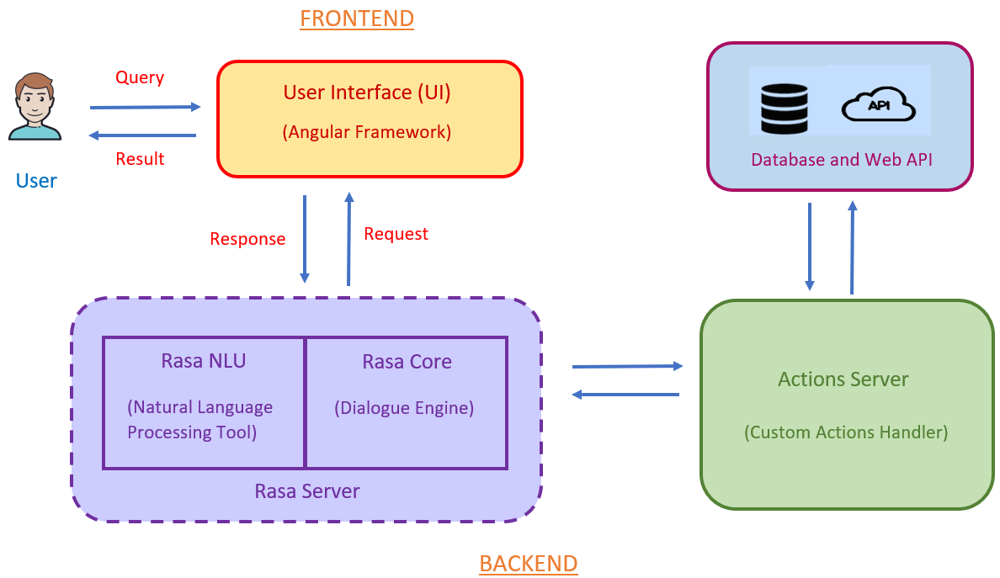

# Conversation AI text-based ChatBot

Please checkout the demo of our bot [here](https://drive.google.com/file/d/1bwMM5NbtLLO4iFElThYW8zcxyAeyj3ea/view?usp=sharing).

## Project Description

The project has the following objectives :
-   Conversational AI text based search bot which assists user with dialogue interaction.
-   Webpage finder to redirect user to correct mastercard webpage.
-   ATM locator to locate ATMs of specified locations.
-   Machine learning to enhance productivity rather than using static integrations.
-   NLP to provide highly engaging user experience.

Following are the requirements of this project :
-   User friendly messenger UI.
-   Appropriate response to the user’s query.
-   Respond with simple and understandable language.
-   Effectively handle multiple users online.
-   Ability to handle all valid use cases as well as unknown messages or chitchat.

## Installation Guide:

### Ubuntu

This requires python version 3.6 or 3.7.
1.  Open the terminal
2.  Create a new virtual environment :

    >   python3 -m venv env
3.  Activate the virtual environment :

    >   source  env/bin/activate
4.  Install the required libraries :

    >   python3 -m pip install -r requirements

    >   python3 -m spacy download en_core_web_md

    >   python3 -m spacy link en_core_web_md en

### Windows
This requires python version 3.6 or 3.7.
1. Open command prompt as administrator.
2. Create a new virtual environment by choosing a Python interpreter and making a .\venv directory to hold it:

    >   python -m venv ./venv
3. Activate the virtual environment:

    >   .\venv\Scripts\activate
4.  Install the required libraries :

    >   pip3 install -r requirements.txt

    >   python -m spacy download en_core_web_md

    >   python -m spacy link en_core_web_md en

## How to run

### Ubuntu

1.  To run this project, we need to run Rasa server, Actions server and Angular Framework.
2.  Change your working directory to *rasa-bot*.
3.  Enter the following command. This will run the Rasa server.

    >   rasa run
4.  Next run the Actions server.

    >   rasa run actions
5.  Now change directory to *searchbot-ui* and run the Angular framework.

    >   npm start

    or

    >   ng serve --proxy-config proxy.conf.json
6.  Open localhost:4200 in browser and you can chat with the bot.

### Windows

1.  To run this project, we need to run Rasa server, Actions server and Angular Framework.
2.  Activate the virtual environment:

    >   .\venv\Scripts\activate  
3.  Change your working directory to *rasa-bot*.
4.  Enter the following command. This will run the Rasa server.

    >   rasa run --enable-api
5.  Next run the Actions server in another terminal.

    >   rasa run actions
6.  Now change directory to *searchbot-ui* and run the Angular framework.

    >   npm start

    or

    >   ng serve --proxy-config proxy.conf.json
7.  Open localhost:4200 in browser and you can chat with the bot.

## Solution Overview

The project is divided into 3 parts :
1.  **Rasa** :  Rasa is an open source AI framework for building contextual assistants. Rasa is the main component that is responsible for handling live conversation with the user. Rasa include :
    -   Rasa NLU : Determine what user wants and captures key contextual information.
    -   Rasa Core : Selects the next best response or action based on context of current conversation.

    For more info about Rasa, [click here](https://rasa.com/docs/rasa/)
2.  **Actions server** :  For handling custom actions. Custom actions include doing some computation, getting data from database, making request for data to the web API and retrieving it from web, searching, handling requests from rasa server, etc.
3.  **Angular** : Angular allows to develop attractive and user-friendly UI. Other usage is sending HTTP request to the backend server and getting response from it.

## ATM locator Use Case

-   The user interact with the UI and pass a query.
-   This query is passed to NLU component which recognize what is the intent or purpose of the message. The purpose is obvious that user wants the atm addresses.
-   Entities are the supporting but necessary information, eg, in this case location : Pune is the entity.
-   Now this info is passed to the core component that decides further what is to be done, that is in this case call the custom action to collect the addresses.
-   The Mastercard ATMs API requires latitude-longitude values for accurate results. So Google’s Geocoding API is used for converting the location value into geo-coordinates. These geo-coordinates are used for retrieving ATM data from the Web API.
-   The retrieved data is then send back frontend to display it on the bot window.

## Webpage Finder Use Case

-   The user interact with the UI and pass a query.
-   This query is passed to NLU component which recognize what is the intent or purpose of the message. Here, RASA NLU classifies the intent as webpage finder.
-   Then, the important keyword/entity is extracted from user's query. In this example, the important keyword is *tax*.
-   Now this info is passed to the core component that decides further what is to be done, that is in this case call the custom action.
-   The custom action fetches the URL of the webpage associated with keyword *tax* from the [database](rasa-bot/lookup-files/keywords-urls.csv).
-   The searching algorithm looks for the appropriate paragraph depending on the user's query from the scrapped-data of the webpage that is stored in the file *rasa-bot/scrapper/[keyword].json*.
-   The retrieved paragraph and the URL of the webpage are then send back to display on the bot window.

## FAQ Use Case

-   The user interact with the UI and pass a query.
-   This query is passed to NLU component where intent gets classified correctly but entities are not extracted then support actions checks FAQ page.
-   FAQ page is scraped in json format and the question is searched using searching technique.
-   If the question is found in FAQ page then bot returns respective answer in output otherwise it asks user to reframe the query.
-   The output is then send back frontend to display it on the bot window.

## Fallback Case

-   User types some random message not related to our use cases then fallback action gets called.
-   As none of the intents gets classified and confidence is below threshold, fallback action once again checks for FAQ in scraped FAQ page. If answer is matched, it returns answer.
-   If none of the FAQs is matched then the intent with maximum confidence among the lower ones gets called, and it returns appropriate intent message or asks to reframe the sentence.
-   In this way, chat bot handles corner cases also.
